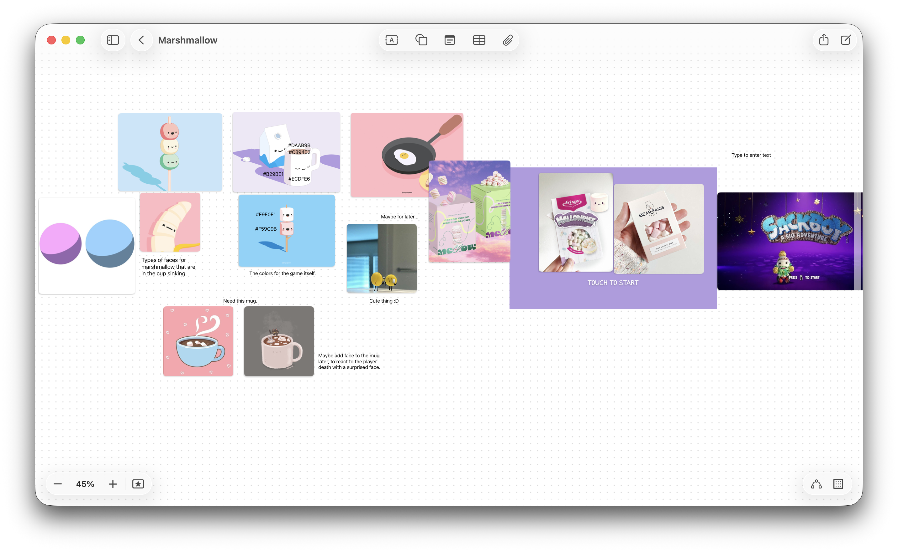
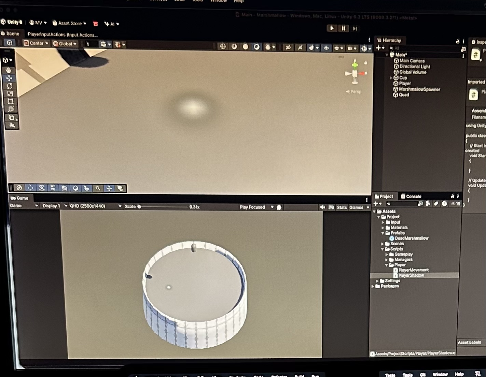
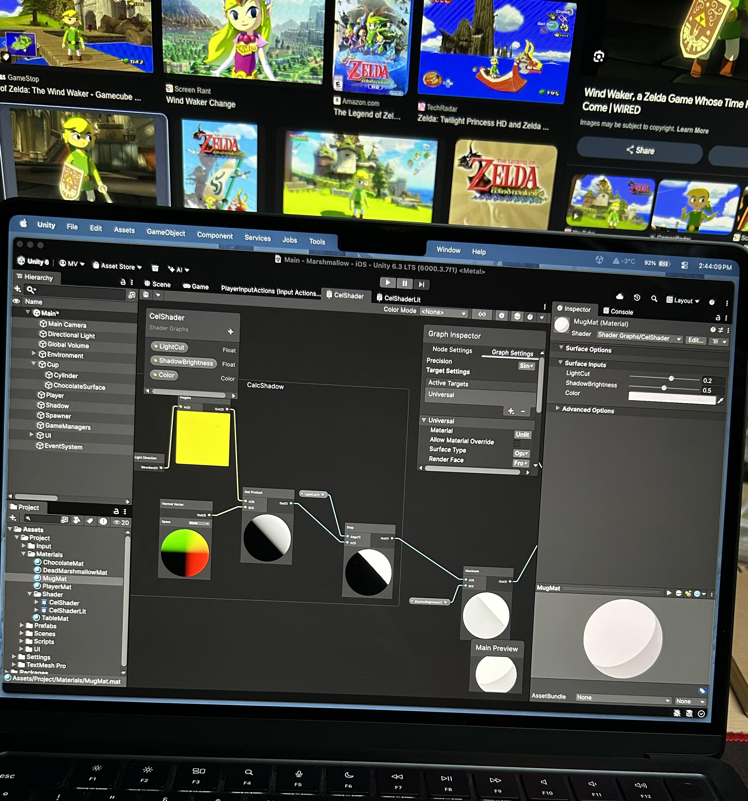
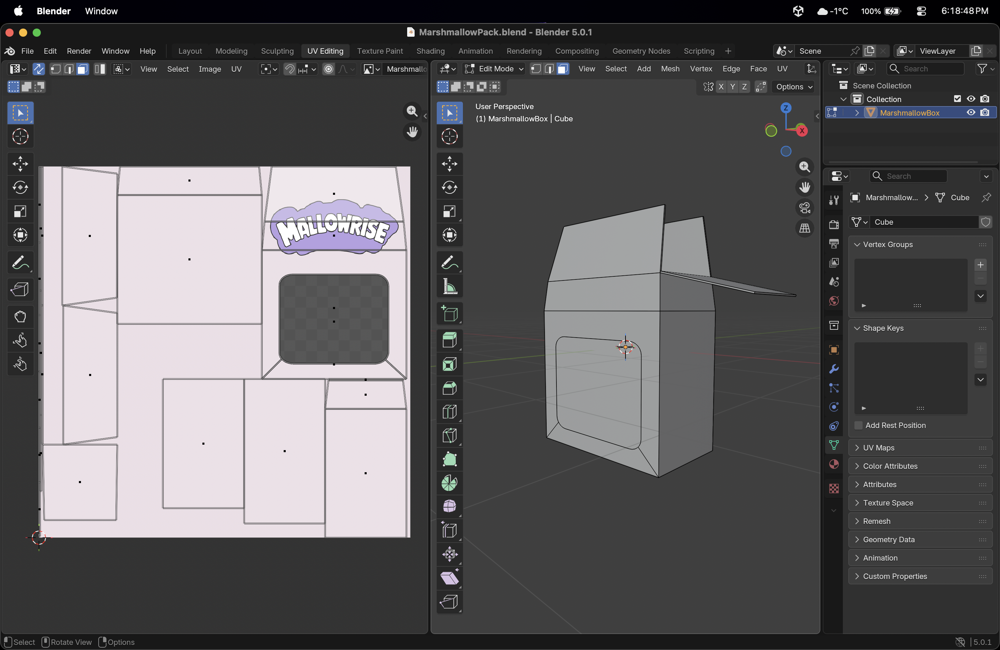

# 🍡 MallowRise

**MallowRise** is a minimalistic arcade platformer built in **Unity (C#)** and designed primarily for **iOS devices**.

You control a small marshmallow jumping upward through a stylized hot-chocolate world filled with dynamic platforms. The focus of the game is clean mechanics, responsive controls, and optimized performance.

- Play WebGL version here.

>https://future-apocalypse.github.io/futureapocalypse/#portfolio
---

## 📱 Platform & Tech Stack

- **Engine:** Unity
- **Language:** C#
- **Target Platform:** iOS / WebGL
- **Architecture:** Component-based (Unity standard)
- **Optimization Focus:** Mobile performance & object pooling

---

## 🎮 Gameplay Overview

MallowRise is an upward endless jumper where:

- The marshmallow jumps between platforms
- Some platforms sink after contact
- Falling into hot chocolate ends the run
- The score increases as the player climbs higher
- The goal is to beat your best score

The design philosophy is:

> Simple to understand. Difficult to master.

---

## ⚙️ Core Systems Implemented

- Player movement & jump physics
- Object Pooling system (optimized spawning)
- Procedural platform spawning
- Sinking platform behavior
- Score tracking system
- Particle effects on impact
- Basic UI system (Game Over / Score / Restart)
- Scene-based game flow (Menu → Game → Game Over)

---

## 🏗 Architecture Highlights

### Object Pooling
To avoid unnecessary instantiation and garbage collection spikes on mobile, platforms are reused using a pooling system.

### Spawner System
A controlled spawning loop dynamically creates gameplay progression based on height and difficulty.

### Modular Components
Each gameplay mechanic (movement, platform logic, sinking behavior) is isolated in its own script for maintainability and scalability.

---

## 🎨 Visual Style

- Minimalistic
- Soft, playful aesthetic
- Inspired by low-poly simplicity
- Clean UI with clear hierarchy
- Focus on readability and performance

The environment represents a hot chocolate world, with marshmallow platforms and splash particle effects.

---

## 🖼 Behind The Scenes

Below are development screenshots and work-in-progress moments from the creation of MallowRise.

> 

### Early Prototype

### Shader

### Blender modeling

---

## 👨‍💻 Author

Developed by Mihail Verejan

Focused on building optimized mobile games and clean interactive systems.

---

## 📌 Status

Active development / Portfolio project  
Built as part of a personal journey into mobile game development and performance-focused Unity architecture.

---

If you like the project, feel free to ⭐ the repository.